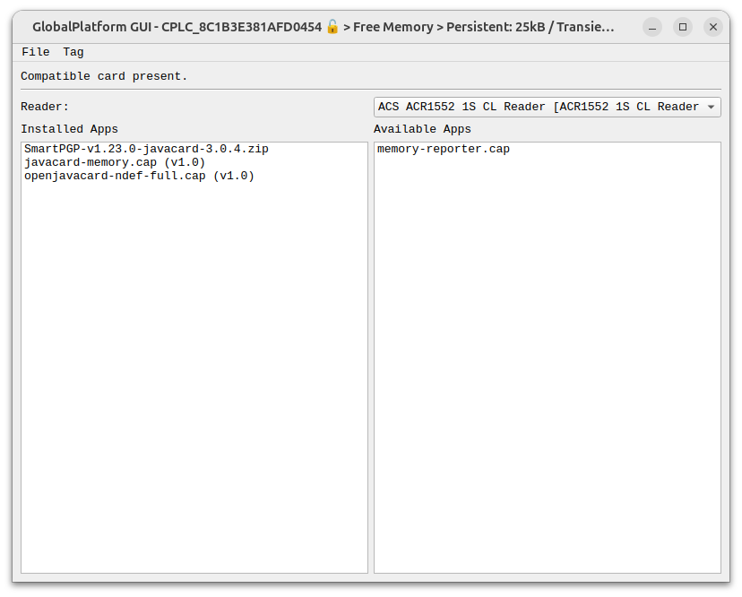
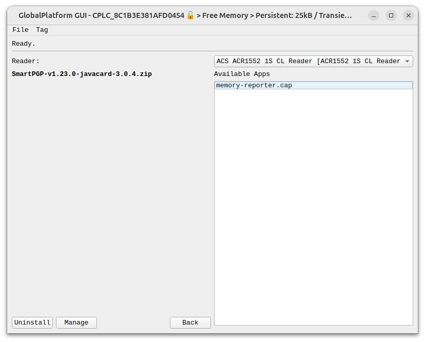
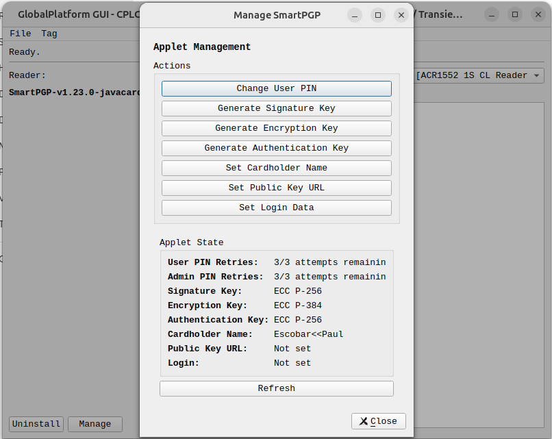
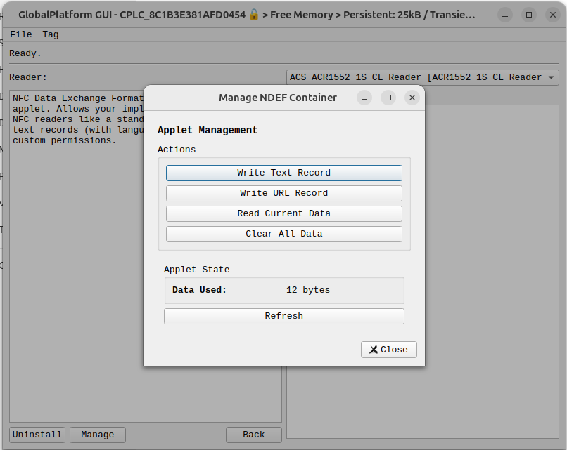
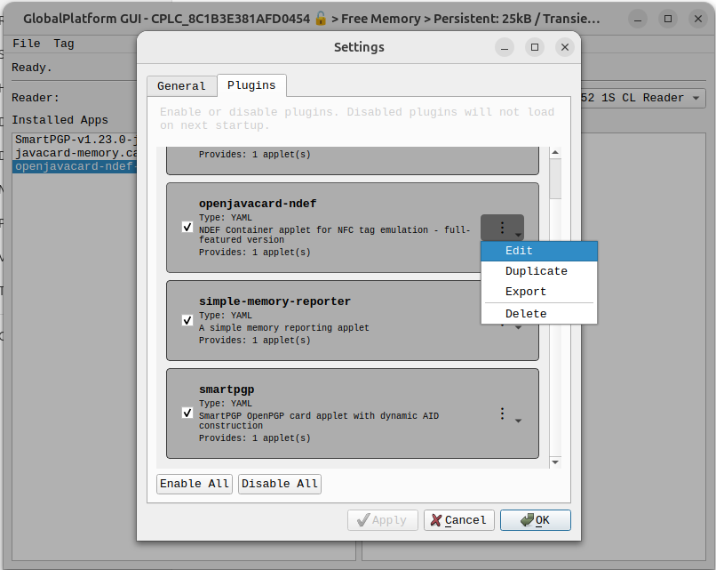

# Global Platform GUI

A cross-platform GUI wrapper for [Global Platform Pro](https://github.com/martinpaljak/GlobalPlatformPro) by [Martin Paljak](https://github.com/martinpaljak), geared towards the [flexSecure](https://dngr.us/flexsecure).

Tons of credit go to [@Stargate01](https://github.com/stargate01), [@GrimEcho](https://forum.dangerousthings.com/u/grimecho/summary), and [@pilgrimsmaster](https://forum.dangerousthings.com/u/pilgrimsmaster/summary).

Looking for more information? Check out the [flexSecure repo docs](https://github.com/DangerousThings/flexsecure-applets/tree/master/docs).

> [!CAUTION]
> Disclaimer: Use at your own risk. I'm not liable for bricked chips.<br />
> DO NOT USE ON APEX DEVICES--THE DEVICE WILL BE BRICKED!
> <br />
> <br />
> Now that we got that over. The risk is no greater than using Global Platform Pro.
> During every call to gp, this app checks its config to see if the smart card
> scanned: A, has been scanned before, and B, has a default key. If either condition
> is false, it bails. However, if you give it an incorrect key, it will send it. Enough
> consecutive, incorrect key entries will brick your device.

> [!NOTE]
> If you do accidentally enter an invalid key, entering the correct key will reset
> the counter.

## Features

- Supports non-default master keys
- Supports changing master keys
- Can store keys securely--or not
- Decodes AIDs to names of flexSecure apps
- Displays descriptions of apps (where provided)
- Reports available memory (if app is installed)
- Installs the latest version of an app
- Can uninstall apps
- **YAML Plugin System** - Create custom plugins with a visual designer
  - Define applet sources (GitHub releases, HTTP, local files)
  - Custom actions and workflows
  - Parameter collection with validation
  - **Auto-discovery**: Repos with `gp-plugin.yaml` are automatically detected
- Supports NDEF Installation
  - Container Size
  - Permissions
  - Initial Record (Text and URI)

<br />

<br />

<br />

<br />



## Quick Start

### Binary

Check the [latest release](https://github.com/DangerousThings/global-platform-gui/releases) for pre-built binaries:
- **Linux**: AppImage
- **Windows**: Portable executable
- **macOS**: DMG with signed app bundle

### From Source

Requirements:
- Python 3.8+
- Java (for GlobalPlatformPro)

```bash
# Clone the repository
git clone https://github.com/DangerousThings/global-platform-gui.git
cd global-platform-gui

# Install dependencies
pip install -r requirements.txt

# Run
python main.py
```

## Building

A Makefile is provided for building on all platforms:

```bash
# Show all build options
make help

# Build for current platform
make all

# Platform-specific builds
make linux          # Linux AppImage
make linux-signed   # Linux AppImage with GPG signature
make macos          # macOS .app bundle + DMG
make macos-signed   # macOS with GPG signature
make windows        # Windows executable (run on Windows)
```

### Signing

Builds can be signed for distribution:

```bash
# GPG signing (all platforms, works with hardware tokens)
GPG_KEY=your-key-id make linux-signed

# macOS code signing + notarization
CODESIGN_IDENTITY="Developer ID Application: Name (TEAMID)" make macos-signed

# Windows Authenticode (run on Windows)
set SIGNTOOL_CERT=path\to\cert.pfx
set SIGNTOOL_PASSWORD=password
build_scripts\windows\build_windows.bat
```

### Development

```bash
# Install dev dependencies
make dev

# Run tests
make test

# Format code
make format

# Check code style
make lint
```

## For CAP File Providers

If you host JavaCard applets (CAP files), you can provide a plugin definition that users can automatically import. Add a `gp-plugin.yaml` file to your repository root:

```yaml
schema_version: "1.0"

plugin:
  name: my-applet
  description: Description of what the applet does
  version: "1.0.0"
  author: Your Name

applet:
  source:
    type: github_release
    owner: your-username
    repo: your-repo
    asset_pattern: "*.cap"  # Pattern to match CAP files in releases

  metadata:
    aid: D276000085304A434F9001  # Package AID
    storage_required: 10000      # Bytes required

# Optional: Custom installation UI
install_ui:
  fields:
    - id: pin
      label: "Initial PIN"
      type: text
      validation:
        pattern: "^[0-9]{4,8}$"
        message: "PIN must be 4-8 digits"

# Optional: Management actions for installed applet
management_ui:
  actions:
    - id: change_pin
      label: "Change PIN"
      type: apdu_sequence
      apdu:
        - "00 20 00 82 {old_pin}"
        - "00 24 00 82 {new_pin}"
```

When users point Global Platform GUI at your repository, it will detect the plugin definition and offer to import it automatically.

**Supported locations:**
- `gp-plugin.yaml` or `.gp-plugin.yaml` in repo root
- `*.gp-plugin.yaml` in GitHub release assets

## Known Issues

- No real validation for URI record creation

## Roadmap

- [ ] App version display in detail pane
- [ ] Encrypted NDEF records
- [ ] Multiple NDEF records
- [ ] MIME records
- [ ] Status.im support
- [ ] CAP file caching
- [ ] Export/backup of app config and secure storage
