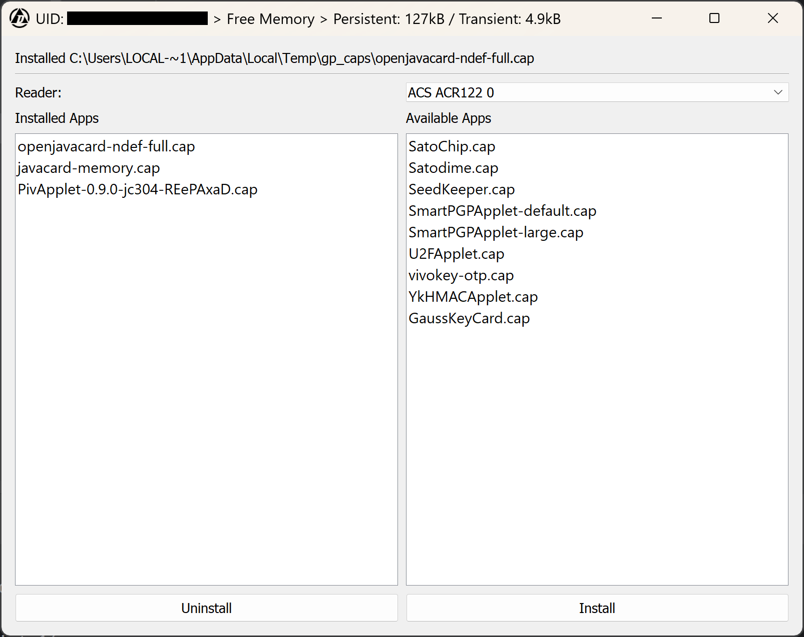
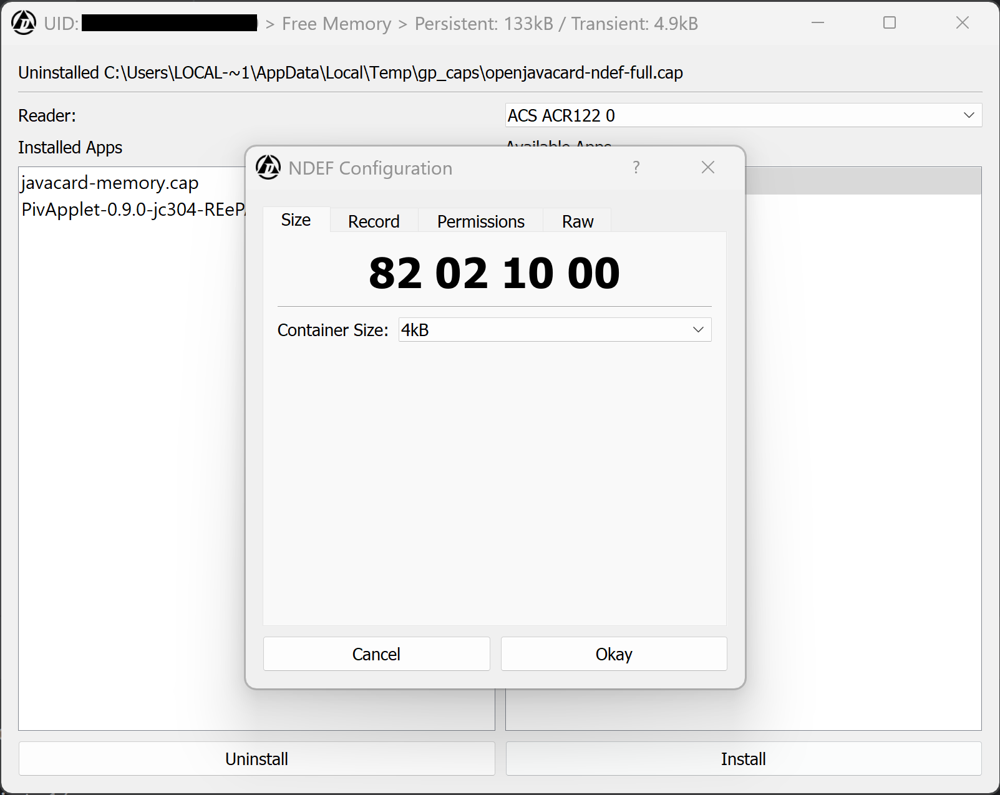

# Global Platform GUI
A quick attempt at GUI wrapper for [Global Platform Pro](https://github.com/martinpaljak/GlobalPlatformPro) by 
[Martin Paljak](https://github.com/martinpaljak) geared towards the [flexSecure](https://dngr.us/flexsecure).
Tons of credit go to [@Stargate01](https://github.com/stargate01), [@GrimEcho](https://forum.dangerousthings.com/u/grimecho/summary), and [@pilgrimsmaster](https://forum.dangerousthings.com/u/pilgrimsmaster/summary).

Looking for more information? Checkout the [flexSecure repo docs](https://github.com/DangerousThings/flexsecure-applets/tree/master/docs).

> [!CAUTION]
> DO NOT USE ON APEX DEVICES OR THOSE OTHERWISE CONFIGURED WITH NON-DEFAULT PASSWORDS--THE DEVICE WILL BE BRICKED!

Rebooted from Tkinter to PyQt. Still early.

Features:
- Decodes AIDs to names of flexSecure apps
- Reports available memory (if app is installed)
- Installs the latest version of an app
- Can uninstall apps
- Supports NDEF Installation
  - Container Size
  - Permissions
  - Initial Record (Text and URI atm)
    - Not much in the way of validation/cleaning
- 'Plugins' can be made to support other resources and advanced (read: requires params) installs
- Will probably break at random





## Known Issues
- Reader selection hasn't been tested
- Sometimes throws an error if a card is present on app start
- No real validation URI record creation

## Forthcoming
- Non-standard key handling
- Better NDEF support
  - Support encrypted records like @hoker's Apex Manager?
  - Support writing of NDEF records to NTAGs, DESFire, etc?
- Version reporting
- cap file caching
- 'Plugins' that don't require rebuilding if you're using a binary

## Quick Start

### Binary

Check the latest release

### From Source:

- Don't have Python? Get it.
- Not running Windows? Make sure you have Java.
- Download and extract or clone the repo
- Install the required packages

Install

```bash
pip install "requirements.txt" 
```

Run

```bash
python main.py
```
