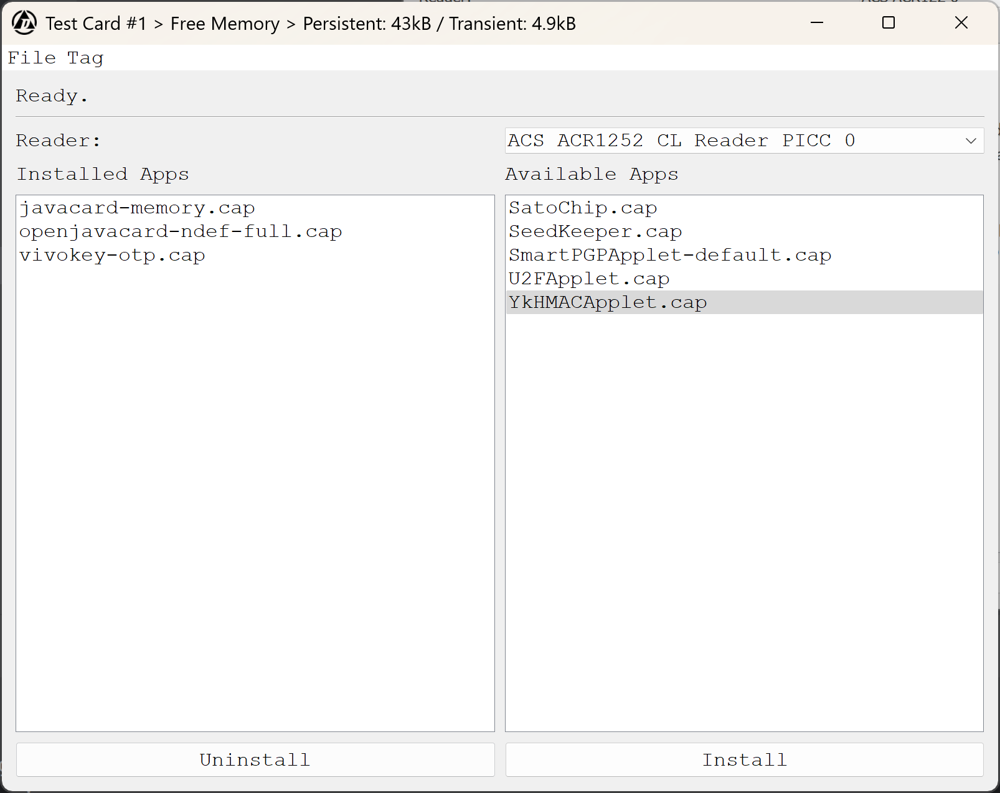
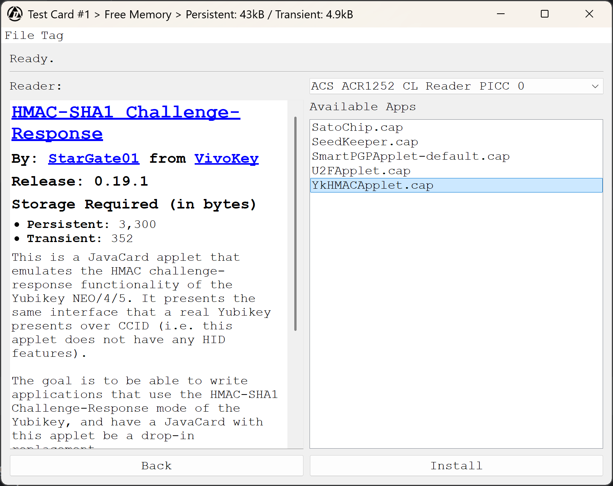

# Global Platform GUI
A quick attempt at GUI wrapper for [Global Platform Pro](https://github.com/martinpaljak/GlobalPlatformPro) by 
[Martin Paljak](https://github.com/martinpaljak) geared towards the [flexSecure](https://dngr.us/flexsecure).
Tons of credit go to [@Stargate01](https://github.com/stargate01), [@GrimEcho](https://forum.dangerousthings.com/u/grimecho/summary), and [@pilgrimsmaster](https://forum.dangerousthings.com/u/pilgrimsmaster/summary).

Looking for more information? Checkout the [flexSecure repo docs](https://github.com/DangerousThings/flexsecure-applets/tree/master/docs).

> [!CAUTION]
> Disclaimer: Use at your own risk. I'm not liable for bricked chips.<br />
> DO NOT USE ON APEX DEVICES--THE DEVICE WILL BE BRICKED!
> <br />
> <br />
> Now that we got that over. The risk is no greater than using Global Platform Pro.
> During every call to gp, this is app checks its config to see if the smart card
> scanned: A, has been scanned before, and B, has a default key. If either condition
> is false, it bails. However, if you give it an incorrect key, it will send it. Enough
> consecutive, incorrect key entries will brick your device.

> [!NOTE]
> If you do accidentally enter an invalid key, entering the correct key will reset
> the counter. 👍

Rebooted from Tkinter to PyQt. Still early.

Features:
- Supports non-default master keys
- Supports changing master keys
- Can store keys securely--or not
- Decodes AIDs to names of flexSecure apps
- Displays descriptions of apps (where provided)
- Reports available memory (if app is installed)
- Installs the latest version of an app
- Can uninstall apps
- 'Plugins' can be made to support other resources and advanced (read: requires params) installs
- Supports NDEF Installation (example of a plugin that uses params)
  - Container Size
  - Permissions
  - Initial Record (Text and URI atm)
    - Not much in the way of validation/cleaning
- Will probably break at random

<br />

<br />

<br />


## Known Issues
- No real validation URI record creation

## Forthcoming
- [x] Support for changing master keys
- [x] Secure storage for keys and the like
- App Detail Pane
  - [x] Description
  - [ ] Version
  - [x] Release it's from
  - [x] Storage Requirements
- Better NDEF support
  - [ ] Support encrypted records like @hoker's Apex Manager?
  - [ ] Support writing of NDEF records to NTAGs, DESFire, etc?
  - [ ] Multiple records
  - [ ] Mime Records
- [ ] Status.im support
- [ ] cap file caching
- [ ] 'Plugins' that don't require rebuilding if you're using a binary
- [ ] Exporting/backing up of app config, secure storage, and key if applicable

## Quick Start

### Binary

Check the latest release

### From Source:

- Don't have Python? Get it.
- Not running Windows? Make sure you have Java.
- Download and extract or clone the repo
- Install the required packages

Install

```bash
pip install "requirements.txt" 
```

Run

```bash
python main.py
```
